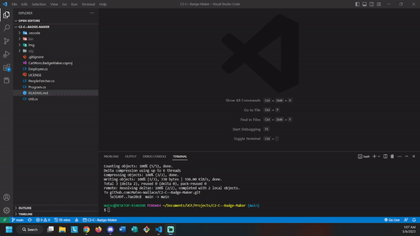
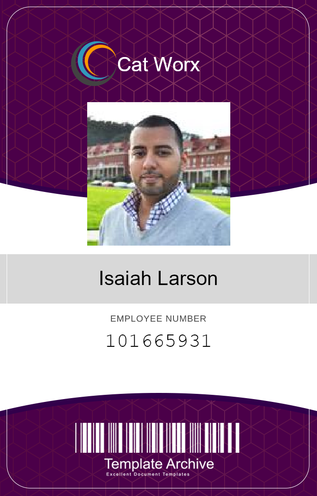

 

# C# Badge Maker

## Description

C# Badge Maker is a Command Line Application that allows users to generate Id badge pngs that include a workers name, id, and photo. It was built to learn C#.

While building this project I learned to:

- Write C# variables by defining what they are, for example instead of `var bl = true` you would write `bool bl = true`
- Install C# packages using `dotnet`
- Manipulate the file system to generate files and folders
- Import packages with the `using` tag. Primarily from the `System` but also from dotnet packages
- Run a C# file by using `dotnet run` or `dotnet watch`

### Built With

## Table of Contents

- [Installation](#installation)
- [Usage](#usage)
- [Contributing](#contributing)
- [License](#license)
- [Contact](#contact)

## Installation

1. Fork the repo
1. Clone the code to your local machine
1. Open in `VS Code`
1. Use the `restore` command

(<a href="#readme-top">back to top</a>)

## Usage

From the terminal run `dotnet run` to begin the application.

1. You will be asked if you would like to auto generate ids. If true 10 ids will be generated and placed within the `data` folder. If false continue reading.
1. You will be asked to enter a first name, last name, id, and photo url. For the photo url feel free to use `https://placekitten.com/300/300` .
1. Once you have finished entering one id you may either continue entering ids or simply hit enter with no input to finish. Ids will be generated and placed within the `data` folder.

The gif below shows the functional app:

The image below is an example output id:

(<a href="#readme-top">back to top</a>)

## Contributing

If you have a suggestion that would make the repo better, please fork the repo and create a pull request. You can also simply open an issue with the tag "enhancement". Don't forget to give the project a star! Thanks again!

1. Fork the Project
1. Create your Feature Branch (`git checkout -b feature/AmazingFeature`)
1. Commit your Changes (`git commit -m 'Add some AmazingFeature'`)
1. Push to the Branch (`git push origin feature/AmazingFeature`)
1. Open a Pull Request

If all of this is new to you take a look at the [GitHub Docs](https://docs.github.com/en/get-started/quickstart/fork-a-repo).

(<a href="#readme-top">back to top</a>)

## License

Distributed under the MIT License. See [LICENSE](./LICENSE) for more information.

(<a href="#readme-top">back to top</a>)

## Contact

Mateo Wallace - [GitHub](https://github.com/Mateo-Wallace) - [Email](mailto:mateo.t.wallace@gmail.com) - [LinkedIn](https://www.linkedin.com/in/mateo-wallace/)

(<a href="#readme-top">back to top</a>)

